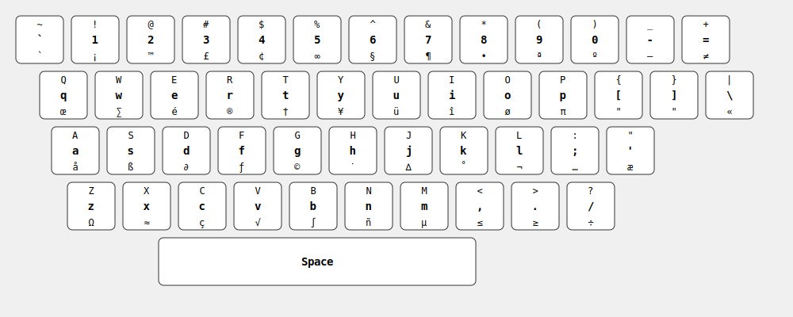

# US Keyboard Layout Cheatsheet

## Number Row

| Key | Base Layer    | Shift Layer     | Alt Layer   |
| --- | ------------- | --------------- | ----------- |
| \`  | \` (backtick) | ~ (tilde)       | \`          |
| 1   | 1             | !               | ¡           |
| 2   | 2             | @               | ™          |
| 3   | 3             | #               | £           |
| 4   | 4             | $               | ¢           |
| 5   | 5             | %               | ∞           |
| 6   | 6             | ^               | §           |
| 7   | 7             | &               | ¶           |
| 8   | 8             | \*              | •           |
| 9   | 9             | (               | ª           |
| 0   | 0             | )               | º           |
| -   | - (hyphen)    | \_ (underscore) | – (en dash) |
| =   | =             | +               | ≠           |

## Top Letter Row

| Key | Base Layer | Shift Layer | Alt Layer |
| --- | ---------- | ----------- | --------- |
| Q   | q          | Q           | œ         |
| W   | w          | W           | ∑         |
| E   | e          | E           | é         |
| R   | r          | R           | ®        |
| T   | t          | T           | †         |
| Y   | y          | Y           | ¥         |
| U   | u          | U           | ü         |
| I   | i          | I           | î         |
| O   | o          | O           | ø         |
| P   | p          | P           | π         |
| [   | [          | {           | "         |
| ]   | ]          | }           | "         |
| \\  | \\         | \|          | «         |

## Home Row

| Key | Base Layer | Shift Layer | Alt Layer |
| --- | ---------- | ----------- | --------- |
| A   | a          | A           | å         |
| S   | s          | S           | ß         |
| D   | d          | D           | ∂         |
| F   | f          | F           | ƒ         |
| G   | g          | G           | ©        |
| H   | h          | H           | ˙         |
| J   | j          | J           | ∆         |
| K   | k          | K           | ˚         |
| L   | l          | L           | ¬         |
| ;   | ;          | :           | …         |
| '   | '          | "           | æ         |

## Bottom Row

| Key | Base Layer | Shift Layer | Alt Layer |
| --- | ---------- | ----------- | --------- |
| Z   | z          | Z           | Ω         |
| X   | x          | X           | ≈         |
| C   | c          | C           | ç         |
| V   | v          | V           | √         |
| B   | b          | B           | ∫         |
| N   | n          | N           | ñ         |
| M   | m          | M           | µ         |
| ,   | ,          | <           | ≤         |
| .   | .          | >           | ≥         |
| /   | /          | ?           | ÷         |

## Space Row

| Key   | Base Layer | Shift Layer | Alt Layer            |
| ----- | ---------- | ----------- | -------------------- |
| Space | (space)    | (space)     | (non-breaking space) |

Note:

- Alt Layer refers to Option key on Mac
- Some Alt Layer combinations may vary depending on your operating system and keyboard settings
- Not all Alt Layer combinations are available on all systems
- On Windows, Alt codes work differently and require using the numeric keypad
